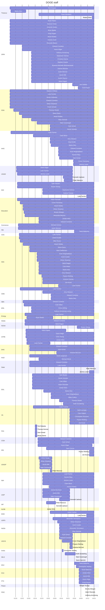

# DOGE Staff by Agency

```mermaid
gantt
    title DOGE staff
    todayMarker off
    axisFormat %m/%d
    dateFormat YYYY-MM-DD
    SECTION Treasury
        Tom Krause : 2025-01-20, 2025-04-20
        Marko Elez : 2025-01-21, 2025-02-06
        Ryan Wunderly : 2025-02-20, 2025-04-20
        Roland Shen : 2025-04-18, 2025-04-20
    SECTION OPM
        Noah Peters : 2025-01-20, 2025-04-20
        Keenan Kmiec : 2025-01-20, 2025-04-20
        Amanda Scales : 2025-01-20, 2025-04-20
        Brian Bjelde : 2025-01-20, 2025-04-20
        Greg Hogan : 2025-01-20, 2025-04-20
        Akash Bobba : 2025-01-20, 2025-04-20
        Charles Ezell : 2025-01-20, 2025-04-20
        Riccardo Biasini : 2025-01-20, 2025-04-20
        Edward Coristine : 2025-02-02, 2025-04-20
        Gavin Kliger : 2025-02-02, 2025-04-20
        Anthony Armstrong : 2025-02-12, 2025-04-20
        Stephanie Holmes : 2025-02-12, 2025-04-20
        Christina Hanna : 2025-02-12, 2025-04-20
        Stephen Duarte : 2025-02-12, 2025-04-20
        Bryanne-Michelle Mlodzianowski : 2025-02-12, 2025-04-20
        Joanna Wischer : 2025-02-12, 2025-04-20
        Justin Monroe : 2025-02-12, 2025-04-20
        Jacob Altik : 2025-02-12, 2025-04-20
        Austin Raynor : 2025-02-12, 2025-04-20
        Nikhil Rajpal : 2025-02-12, 2025-04-20
        Joe Gebbia : 2025-03-28, 2025-04-20
        Scott Kupor : 2025-04-03, 2025-04-20
    SECTION GSA
        Stephen Ehikian : 2025-01-20, 2025-04-20
        Luke Farritor : 2025-01-20, 2025-04-20
        Nicole Hollander : 2025-01-20, 2025-04-20
        Edward Coristine : 2025-01-20, 2025-04-20
        Ethan Shaotran : 2025-01-20, 2025-04-20
        Frank Schuler : 2025-01-20, 2025-04-20
        Thomas Shedd : 2025-01-24, 2025-04-20
        Steve Davis : 2025-01-30, 2025-04-20
        Akash Bobba : 2025-02-02, 2025-04-20
        Riley Sennott : 2025-02-12, 2025-04-20
        Nate Cavanaugh : 2025-02-18, 2025-04-20
        Kyle Schutt : 2025-03-04, 2025-04-20
        Derek Geissler : 2025-03-04, 2025-04-20
    SECTION HHS
        Luke Farritor : 2025-01-21, 2025-04-20
        Clark Minor : 2025-02-14, 2025-04-20
        Amy Gleason : 2025-03-04, 2025-04-20
        Brad Smith : 2025-03-04, 2025-04-20
        Marko Elez : 2025-03-05, 2025-04-20
        Edward Coristine : 2025-03-13, 2025-04-20
        Aram Moghaddassi : 2025-03-13, 2025-04-20
        Rachel Riley : 2025-03-13, 2025-04-20
        Kyle Schutt : 2025-03-14, 2025-04-20
        Conor Fennessy : 2025-03-29, 2025-04-20
        Jeremy Lewin : 2025-03-29, 2025-04-20
    SECTION USAID
        Gavin Kliger : 2025-01-27, 2025-03-28
        Luke Farritor : 2025-01-27, 2025-03-28
        Jeremy Lewin : 2025-01-28, 2025-03-28
        Kenneth Jackson : 2025-03-18, 2025-03-28
        Peter Marocco : 2025-03-19, 2025-03-28
    SECTION DOI
        Tyler Hassen : 2025-01-28, 2025-04-20
        Bryton Shang : 2025-01-28, 2025-04-20
        Stephanie Holmes : 2025-02-24, 2025-04-20
        Katrine Trampe : 2025-02-24, 2025-04-20
        Luke Farritor : 2025-04-12, 2025-04-20
    SECTION Education
        Adam Ramada : 2025-01-28, 2025-04-20
        Conor Fennessy : 2025-01-31, 2025-04-20
        Akash Bobba : 2025-02-03, 2025-04-20
        Ethan Shaotran : 2025-02-03, 2025-04-20
        Brooks Morgan : 2025-02-04, 2025-04-20
        Alexandra Beynon : 2025-02-05, 2025-04-20
        Jordan Wick : 2025-02-20, 2025-04-20
        Edward Coristine : 2025-02-20, 2025-04-20
    SECTION Commerce
        Michael Grimes : 2025-01-29, 2025-04-20
    SECTION FBI
        Justin Monroe : 2025-01-29, 2025-04-20
        Tarak Makecha : 2025-03-30, 2025-04-20
    SECTION CDC
        Luke Farritor : 2025-01-30, 2025-04-20
    SECTION SSA
        Leland Dudek : 2025-01-30, 2025-04-20
        Mike Russo : 2025-01-31, 2025-04-20
        Akash Bobba : 2025-02-03, 2025-04-20
        Steve Davis : 2025-02-10, 2025-04-20
        Mark Steffensen : 2025-02-10, 2025-04-20
        Aram Moghaddassi : 2025-02-18, 2025-04-20
        Scott Coulter : 2025-02-18, 2025-04-20
        Ethan Shaotran : 2025-02-18, 2025-04-20
        Nikhil Rajpal : 2025-02-20, 2025-04-20
        Cole Killian : 2025-02-20, 2025-04-20
        Marko Elez : 2025-02-20, 2025-04-20
        Amy Gleason : 2025-02-20, 2025-04-20
        Payton Rehling : 2025-02-23, 2025-04-20
        Antonio Gracias : 2025-02-24, 2025-04-20
        Jon Koval : 2025-02-24, 2025-04-20
        Luke Farritor : 2025-03-13, 2025-04-20
    SECTION CMS
        Luke Farritor : 2025-01-31, 2025-04-20
        Amy Gleason : 2025-02-24, 2025-04-20
        Edward Coristine : 2025-03-05, 2025-04-20
        Marko Elez : 2025-03-05, 2025-04-20
    SECTION SBA
        Edward Coristine : 2025-02-03, 2025-04-20
    SECTION EPA
        Cole Killian : 2025-02-04, 2025-04-20
        Erica Jehling : 2025-02-12, 2025-04-20
        Kathryn Armstrong Loving : 2025-02-12, 2025-04-20
    SECTION Energy
        Luke Farritor : 2025-02-05, 2025-04-20
        Ryan Riedel : 2025-02-07, 2025-03-07
    SECTION FEMA
        Edward Coristine : 2025-02-05, 2025-04-20
    SECTION NOAA
        Nikhil Rajpal : 2025-02-05, 2025-04-20
        Bryton Shang : 2025-04-02, 2025-04-20
    SECTION CFPB
        Nikhil Rajpal : 2025-02-06, 2025-03-21
        Gavin Kliger : 2025-02-06, 2025-04-20
        Chris Young : 2025-02-06, 2025-04-20
        Jordan Wick : 2025-02-07, 2025-04-20
        Luke Farritor : 2025-02-07, 2025-03-04
    SECTION DHS
        Edward Coristine : 2025-02-10, 2025-04-20
        Kyle Schutt : 2025-02-10, 2025-04-20
        Antoine McCord : 2025-03-11, 2025-04-20
    SECTION HUD
        Scott Langmack : 2025-02-10, 2025-04-20
        Michael Mirski : 2025-02-20, 2025-04-20
    SECTION State
        Edward Coristine : 2025-02-10, 2025-04-20
        Luke Farritor : 2025-02-10, 2025-04-20
        Peter Marocco : 2025-04-11, 2025-04-11~
        Jeremy Lewin : 2025-04-15, 2025-04-20
    SECTION DOL
        Sam Beyda : 2025-02-13, 2025-04-20
        Derek Geissler : 2025-02-13, 2025-04-20
        Cole Killian : 2025-02-13, 2025-04-20
        Adam Ramada : 2025-02-13, 2025-04-20
        Jordan Wick : 2025-02-13, 2025-04-20
        Marko Elez : 2025-02-25, 2025-04-20
        Aram Moghaddassi : 2025-03-05, 2025-04-20
        Miles Collins : 2025-03-05, 2025-04-20
        Thomas Shedd : 2025-03-14, 2025-04-20
        Keith Sonderling : 2025-03-18, 2025-04-20
    SECTION VA
        Justin Fulcher : 2025-02-14, 2025-04-20
        Sahil Lavingia : 2025-03-25, 2025-04-20
        Cary Volpert : 2025-03-25, 2025-04-20
        Christopher Roussos : 2025-03-25, 2025-04-20
        Payton Rehling : 2025-03-25, 2025-04-20
        Jon Koval : 2025-03-25, 2025-04-20
    SECTION FAA
        Ted Malaska : 2025-02-16, 2025-02-18
        Thomas Kiernan : 2025-02-16, 2025-02-18
        Sam Smeal : 2025-02-16, 2025-02-18
        Brady Glantz : 2025-02-16, 2025-02-18
    SECTION CISA
        Edward Coristine : 2025-02-19, 2025-04-20
        Kyle Schutt : 2025-02-19, 2025-04-20
    SECTION IRS
        Gavin Kliger : 2025-02-19, 2025-04-18
        Sam Corcos : 2025-02-28, 2025-04-20
        Payton Rehling : 2025-04-15, 2025-04-20
        Jon Koval : 2025-04-15, 2025-04-20
    SECTION USADF
        Chris Young : 2025-02-20, 2025-03-06
        Ethan Shaotran : 2025-02-21, 2025-03-06
        Jacob Altik : 2025-02-21, 2025-03-06
        Nate Cavanaugh : 2025-02-21, 2025-03-06
        Peter Marocco : 2025-03-04, 2025-03-06
    SECTION NIH
        Luke Farritor : 2025-02-24, 2025-04-20
        Rachel Riley : 2025-02-24, 2025-04-20
        Jeremy Lewin : 2025-02-24, 2025-04-20
        Clark Minor : 2025-02-24, 2025-04-20
        Joshua Hanley : 2025-03-03, 2025-04-20
    SECTION USIP
        James Burnham : 2025-02-24, 2025-03-25
        Jacob Altik : 2025-02-24, 2025-03-25
        Nate Cavanaugh : 2025-02-24, 2025-03-25
        Kenneth Jackson : 2025-03-14, 2025-03-25
    SECTION IAF
        Peter Marocco : 2025-02-28, 2025-03-10
        Kenneth Jackson : 2025-03-10, 2025-03-10
    SECTION NLRB
        Jordan Wick : 2025-02-28, 2025-02-28
    SECTION DOD
        Justin Fulcher : 2025-03-04, 2025-04-20
        Luke Farritor : 2025-04-12, 2025-04-20
    SECTION USPS
        Alexander Simonpour : 2025-03-07, 2025-04-20
        Ethan Shaotran : 2025-03-12, 2025-04-20
    SECTION NASA
        Scott Coulter : 2025-03-14, 2025-04-20
        Alexander Simonpour : 2025-03-14, 2025-04-20
        Riley Sennott : 2025-03-14, 2025-04-20
    SECTION USCIS
        Kyle Schutt : 2025-03-14, 2025-03-28
        Edward Coristine : 2025-03-14, 2025-03-28
        Aram Moghaddassi : 2025-03-17, 2025-03-28
        Payton Rehling : 2025-03-25, 2025-03-28
        Antoine McCord : 2025-03-25, 2025-03-28
    SECTION FHFA
        Christopher Stanley : 2025-03-17, 2025-03-18
    SECTION IMLS
        Keith Sonderling : 2025-03-20, 2025-03-31
        Nate Cavanaugh : 2025-03-31, 2025-03-31
        Gavin Hamrick : 2025-03-31, 2025-03-31
    SECTION DOJ
        Tarak Makecha : 2025-03-30, 2025-04-20
        Christopher Stanley : 2025-04-01, 2025-04-20
    SECTION FCC
        Tarak Makecha : 2025-04-04, 2025-04-20
        Jordan Wick : 2025-04-04, 2025-04-20
        Jacob Altik : 2025-04-04, 2025-04-20
    SECTION FTC
        Gavin Kliger : 2025-04-04, 2025-04-20
        Emily Bryant : 2025-04-04, 2025-04-20
    SECTION Peace
        Bridget Youngs : 2025-04-04, 2025-04-04
    SECTION FDIC
        Brooks Morgan : 2025-04-10, 2025-04-10
        Adam Ramada : 2025-04-10, 2025-04-10
        Anthony Armstrong : 2025-04-10, 2025-04-10
```