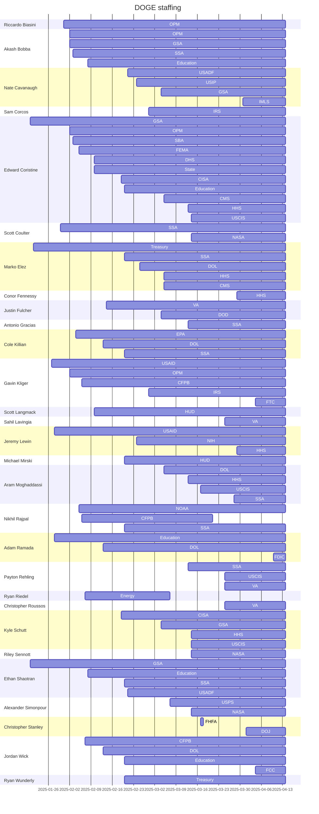

```mermaid
gantt
    title DOGE staffing
    dateFormat YYYY-MM-DD
    section Riccardo Biasini
        OPM : 2025-01-31, 2025-04-14
    section Akash Bobba
        OPM : 2025-02-02, 2025-04-14
        GSA : 2025-02-02, 2025-04-14
        SSA : 2025-02-03, 2025-04-14
        Education : 2025-02-08, 2025-04-14
    section Nate Cavanaugh
        USADF : 2025-02-21, 2025-04-14
        USIP : 2025-02-24, 2025-04-14
        GSA : 2025-03-04, 2025-04-14
        IMLS : 2025-03-31, 2025-04-14
    section Sam Corcos
        IRS : 2025-02-28, 2025-04-14
    section Edward Coristine
        GSA : 2025-01-20, 2025-04-14
        OPM : 2025-02-02, 2025-04-14
        SBA : 2025-02-03, 2025-04-14
        FEMA : 2025-02-05, 2025-04-14
        DHS : 2025-02-10, 2025-04-14
        State : 2025-02-10, 2025-04-14
        CISA : 2025-02-19, 2025-04-14
        Education : 2025-02-20, 2025-04-14
        CMS : 2025-03-05, 2025-04-14
        HHS : 2025-03-13, 2025-04-14
        USCIS : 2025-03-14, 2025-04-14
    section Scott Coulter
        SSA : 2025-01-30, 2025-04-14
        NASA : 2025-03-14, 2025-04-14
    section Marko Elez
        Treasury : 2025-01-21, 2025-04-14
        SSA : 2025-02-20, 2025-04-14
        DOL : 2025-02-25, 2025-04-14
        HHS : 2025-03-05, 2025-04-14
        CMS : 2025-03-05, 2025-04-14
    section Conor Fennessy
        HHS : 2025-03-29, 2025-04-14
    section Justin Fulcher
        VA : 2025-02-14, 2025-04-14
        DOD : 2025-03-04, 2025-04-14
    section Antonio Gracias
        SSA : 2025-03-13, 2025-04-14
    section Cole Killian
        EPA : 2025-02-04, 2025-04-14
        DOL : 2025-02-13, 2025-04-14
        SSA : 2025-02-20, 2025-04-14
    section Gavin Kliger
        USAID : 2025-01-27, 2025-04-14
        OPM : 2025-02-02, 2025-04-14
        CFPB : 2025-02-06, 2025-04-14
        IRS : 2025-02-28, 2025-04-14
        FTC : 2025-04-04, 2025-04-14
    section Scott Langmack
        HUD : 2025-02-10, 2025-04-14
    section Sahil Lavingia
        VA : 2025-03-25, 2025-04-14
    section Jeremy Lewin
        USAID : 2025-01-28, 2025-04-14
        NIH : 2025-02-24, 2025-04-14
        HHS : 2025-03-29, 2025-04-14
    section Michael Mirski
        HUD : 2025-02-20, 2025-04-14
    section Aram Moghaddassi
        DOL : 2025-03-05, 2025-04-14
        HHS : 2025-03-13, 2025-04-14
        USCIS : 2025-03-17, 2025-04-14
        SSA : 2025-03-28, 2025-04-14
    section Nikhil Rajpal
        NOAA : 2025-02-05, 2025-04-14
        CFPB : 2025-02-06, 2025-03-21
        SSA : 2025-02-20, 2025-04-14
    section Adam Ramada
        Education : 2025-01-28, 2025-04-14
        DOL : 2025-02-13, 2025-04-14
        FDIC : 2025-04-10, 2025-04-14
    section Payton Rehling
        SSA : 2025-03-13, 2025-04-14
        USCIS : 2025-03-25, 2025-04-14
        VA : 2025-03-25, 2025-04-14
    section Ryan Riedel
        Energy : 2025-02-07, 2025-03-07
    section Christopher Roussos
        VA : 2025-03-25, 2025-04-14
    section Kyle Schutt
        CISA : 2025-02-19, 2025-04-14
        GSA : 2025-03-04, 2025-04-14
        HHS : 2025-03-14, 2025-04-14
        USCIS : 2025-03-14, 2025-04-14
    section Riley Sennott
        NASA : 2025-03-14, 2025-04-14
    section Ethan Shaotran
        GSA : 2025-01-20, 2025-04-14
        Education : 2025-02-08, 2025-04-14
        SSA : 2025-02-20, 2025-04-14
        USADF : 2025-02-21, 2025-04-14
    section Alexander Simonpour
        USPS : 2025-03-07, 2025-04-14
        NASA : 2025-03-14, 2025-04-14
    section Christopher Stanley
        FHFA : 2025-03-17, 2025-03-18
        DOJ : 2025-04-01, 2025-04-14
    section Jordan Wick
        CFPB : 2025-02-07, 2025-04-14
        DOL : 2025-02-13, 2025-04-14
        Education : 2025-02-20, 2025-04-14
        FCC : 2025-04-04, 2025-04-14
    section Ryan Wunderly
        Treasury : 2025-02-20, 2025-04-14
```
